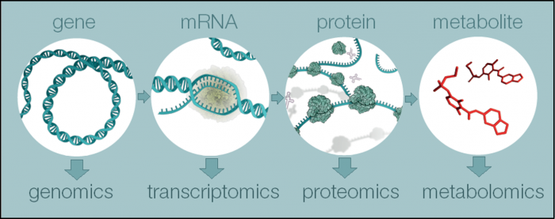
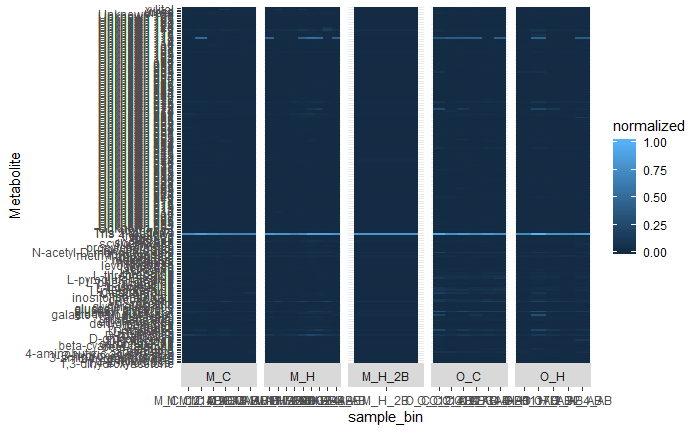

```{r setup, include=FALSE}
knitr::opts_chunk$set(echo = TRUE)
```
## Introduction

  Omics is an umbrella term for all the fields studying all the components from DNA to protein, metabolites, and lipids (What Is Metabolomics?, 2013).
  
    

  Soil contains plant, fungal, insect, bacterial, and viral compositions of all the omics. The Harvard Forest data on plots of soil contained data on compounds of the soil that was either controlled or heated to five degrees above the environment (Rodriguez-Reillo et. al., 2020). William Rodriguez-Reillo and others working on this +15-year soil warming experiment found a decrease in class abundance of fungi and increase in phyla abundance in bacteria (Rodriguez-Reillo1 et. al., 2020). They found a decrease in Carbon compounds when comparing the Organic and Mineral control plots (1,010 and 1,016 compounds) to the heated plots (373 and 368 compounds). A different composition of lipds were found in both Mineral and Organic horizons (Figure 1). Specifically, more lipids and unsaturated hydrocarbons in the carbon compounds were found in the warming soil of the mineral horizon (Fig. 1) while less lignin compounds were found in the carbon compounds of the warming soil of the organic horizon. The paper's analysis of the metatranscriptomic data opened up many avenues on what to analyze including the metabolites, lipids, and proteins. This semester, Nathan Haywood and I sought to understand these -omic compositions using data visualizations. I started with the metabolomic dataset then began analyzing the lipid dataset. 
  
## Metabolomics

  The metabolomic dataset contained 6, 10, 6, and 5 samples of the Control Mineral, Heated Mineral, Control Organic, and Heated Organic soil layer. Each sample contained abundance frequencies of 212 metabolites ranging from Glycerine to GABA to 128 unknown metabolites. A statistical analysis of the control layer to the corresponding heated layer found 29 mineral-layered metabolites and 32 organic-layered metabolites were significantly different in abundance (p-value < 0.05). To visualize the significant metabolites, ggplot via facet_grid was used:
  
  
  
  
  
  A heatmap of all the metabolites are displayed below and show --
  
  
  
  Scientific literature was used to understand specific metabolites that significantly diminished in both the organic layer and mineral layer. The descriptions are [linked here](Metabolites_Boxplots/write-up.html)
  
## Lipids

  Similar to the metabolites, a 2-variable unequal t-test was calculated and a heatmap was made for the control vs. heated plots of lipids. The p-values of less than 0.05 were compiled into two .csv dataframes below. I found that there is a pretty good variety of lipid types within the significant lipids of the two layers (Mineral and Organic). More needs to studies on those lipids using KEGG or BioCyc.
  
  The heatmap was created by normalizing the frequencies and then transforming these values using 'tangent'. (Log cannot be used on negative numbers). After visualizing the heatmap, I found the heated vs. control was not too different. This doesn't help us. The next steps would probably be using a different transformation.
  The list of Significant Mineral Lipids is found [here](Lipidomics/Mineral_Lipids.csv)
  
  The list of Significant Organic Lipids is found [here](Lipidomics/Organic_Lipids.csv)
  
  The heatmap of all the lipids and their frequencies is below: 
  
  ![]](Lipidomics/heatmap_not_so_compelling.png)
  

  