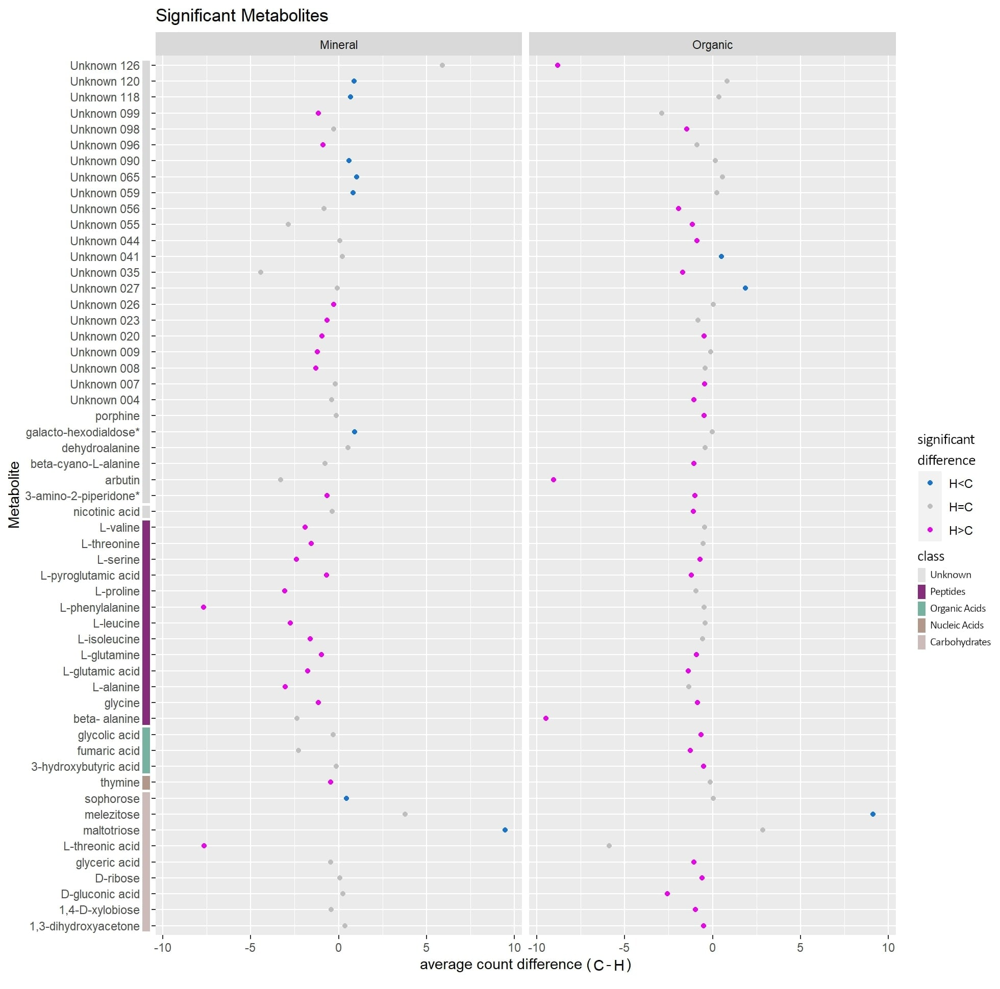

## content

My count data is countdatacsv; df is the count data with categories. mymetadata is my metadata. I am trying to put the df and mymetedata into omu_summary, a function that gives t-test statistics and even folding analysis. I am following this vignette:
https://cran.r-project.org/web/packages/omu/vignettes/Omu_vignette.html


```{r setup, include=FALSE, warning=FALSE, message=FALSE}
knitr::opts_chunk$set(message=FALSE, warning=FALSE)
library(omu)
library(readr)
library(tidyverse)
library(DT)
library(rstatix)
library(ggpubr)
countdata <- read_metabo("EMSL_PNNL_plusKEGG.csv")[-1]
# reads as dataframe not 'array'
#first column was just indices so they were deleted

countdatacsv <- read_csv("EMSL_PNNL_plusKEGG.csv")[-1]
# using read_csv because read_metabo doesn't work for mutate() 
countdatacsv <- countdatacsv %>% mutate_if(is.numeric, round, 0) %>%
  mutate_if(is.double,as.integer) %>%
  mutate_if(is.character,as.factor)

mymetadata <- read_csv("EMSL_PNNL_metadata.csv")[-1] #ditto
mymetadata <- mymetadata %>%
  mutate(Grouped = gsub("_", "", Grouped)) %>%
  mutate_if(is.character, as.factor)
```

```{r their example data analysis}
# their example (below) works fine
# omu package included c57_nos2KO_mouse_metadata and c57_nos2KO_mouse_countDF
# assigning hierarchy characterizes the metabolites:
DF <- assign_hierarchy(count_data = c57_nos2KO_mouse_countDF, keep_unknowns = TRUE, identifier = "KEGG")
theirsummary <- omu_summary(count_data = DF, metadata = c57_nos2KO_mouse_metadata, numerator = "Strep", denominator = "Mock", response_variable = "Metabolite", Factor = "Treatment", log_transform = TRUE, p_adjust = "BH", test_type = "welch")
```

### manually getting stats

```{r}
cleancountdata <- countdata %>% gather(key = "plot", value = "count", M_C_4_AB:O_H_32_AB) %>% mutate(type = gsub("_[0-9][0-9]*_AB","",plot)) %>% mutate(Min.Org = gsub("_[A-Z]","",type)) %>% unite(metabplot, c("Metabolite","Min.Org")) %>% mutate(metabplot = gsub("_2B", "", metabplot)) %>% mutate(type = gsub("_2B","", type))

cleancountdata[cleancountdata == 0] <- 1
cleancountdata$count <- log(cleancountdata$count)
metab.stat <- cleancountdata %>%
  group_by(metabplot) %>%
  t_test(count ~ type) %>%
  adjust_pvalue(method = "BH") %>%
  add_significance()
# summary; mean and st.dev:
MCmean <- cleancountdata %>% group_by(metabplot, type) %>% filter(type == "M_C") %>%
  summarise(meanC = mean(count), st.devC = sd(count)) %>% select(-type)
MHmean <- cleancountdata %>% group_by(metabplot, type) %>% filter(type == "M_H") %>%
  summarise(meanH = mean(count), st.devH = sd(count)) %>% select(-type)
OCmean <- cleancountdata %>% group_by(metabplot, type) %>% filter(type == "O_C") %>%
  summarise(meanC = mean(count), st.devC = sd(count)) %>% select(-type)
OHmean <- cleancountdata %>% group_by(metabplot, type) %>% filter(type == "O_H") %>%
  summarise(meanH = mean(count), st.devH = sd(count)) %>% select(-type)
Minerals <- merge(MCmean, MHmean) %>% mutate(Horizon = "Mineral")
Organics <- merge(OCmean, OHmean) %>% mutate(Horizon = "Organic")
means <- rbind(Minerals, Organics) 
rm(MCmean, MHmean, OCmean,OHmean, Minerals, Organics)
# combine summary and stats:
metab.stat.sum <- merge(metab.stat, means, by = "metabplot", all=TRUE)
metab.stat.sum$foldchange <- metab.stat.sum$meanC/metab.stat.sum$meanH
metab.stat.sum$log2foldchange <- log2(metab.stat.sum$foldchange)
metab.stat.sum$Metabolite <- gsub("_[A-Z]","",metab.stat.sum$metabplot)
# KEGG and heirarchy matching:
KEGG_ID <- read_csv("KEGG.ID.csv")
df <- merge(metab.stat.sum, KEGG_ID, by = "Metabolite", all = TRUE)
df <- as.data.frame(assign_hierarchy(df, keep_unknowns = TRUE, identifier = "KEGG"))
sig <- df[which(df$p <= 0.05),]
head(sig)
# just significant metabolites
# write.csv(df, "Metabolites.withstat.KEGG.hierarchy.foldchange.csv")
df$meancountdifference <- df$meanH - df$meanC
makeStars <- function(x){
  stars <- c("*", "ns")
  vec <- c(0, 0.05 )
  i <- findInterval(x, vec)
  stars[i]
}
sig.legend <- function(x){
  label <- c("H>C", "H<C")
  vec <- c(-10, 0 )
  i <- findInterval(x, vec)
  label[i]
}
df$p.category <- makeStars(df$p)
df[which(df$p.category == "*"),28] <- sig.legend(df[which(df$p.category == "*"),26])
df[is.na(df$V28),28] <- "H=C"
names(df)[names(df) == "V28"] <- "legend"
```

I found `r nrow(sig)` deferentially significant metabolites in both layers with `r sum(sig$group1 == "O_C")` being in the Organic layer while `r sum(sig$group1 == "M_C")` being in the Mineral layer.

### fold change

```{r}
ggplot(metab.stat.sum) + geom_point(aes(x=log2foldchange, y=-log(p.adj), color = p.adj.signif)) + theme(legend.position = "none",
              plot.title = element_text(size = rel(1.5), hjust = 0.5),
              axis.title = element_text(size = rel(1.25)))
```


### Significant Change in metabolite abundance

```{r fig.height=10, fig.width=10}
figure <- df[which(df$Metabolite %in% sig$Metabolite),]
figure <- figure[order(figure$Class),]
figure$Metabolite <- factor(figure$Metabolite, levels = unique(figure$Metabolite))
datatable(figure)
ggplot(figure, aes(x=Metabolite, y=meancountdifference, color = legend)) + geom_point(stat="identity") + ylab("average count difference (C-H)") + xlab("Metabolite") + coord_flip() + ggtitle("Significant Metabolites") + facet_grid(~Horizon) + 
    scale_color_manual(values=c('dodgerblue3','gray','magenta2'))
```

### Edited Figure


