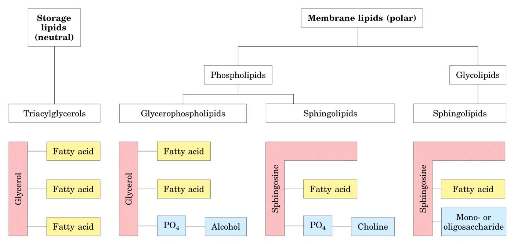

> 

### Introduction

In this code, splitnn is the list of dataframes for the four groups: Mineral Layer Control, Mineral Layer Heater, Organic Layer Control, and Organic Layer Heated. The lipid abundances were normalized and compared. There were 19 lipids in the Mineral layer that significantly (p < 0.05) reduced in abundance from Control to heated. There were also 9 lipids in the Organic layer that significantly reduced in abundance, and 3 lipids in the Organic layer - PC(18:1/18:2)_B, TG(58:9), and TG(53:5) - that increased in abundance.

```{r setup, include=FALSE}
knitr::opts_chunk$set(echo = TRUE)
library(ggpubr)
library(flexdashboard)
library(crosstalk)
library(plotly)
library(tidyverse)
library(rJava)
library(xlsx)
library(readxl)
library(openxlsx)
library(ggplot2)
library(gridExtra)
```

```{r imported data, include=FALSE}
POS <- read.csv("Blanchard_Lipid_POS.csv", header=TRUE)
NEG <- read.csv("Blanchard_Lipid_NEG.csv", header=TRUE)
### Cleaned names
names(POS) <- gsub(x = names(POS), pattern = "_POS", replacement = "_")  
names(NEG) <- gsub(x=names(POS), pattern="_NEG", replacement="_")
### add Column with POS or NEG
POS$charge <- c(rep("POS",117))
NEG$charge <- c(rep("NEG", 75))
combined <- rbind(POS, NEG)
names(combined) <- gsub(x = names(POS), pattern = "Blanch_Nat_Lip_", replacement = "")  
rc <- combined[,c(-1,-2)]
n <- gather(rc, key='plot', value=frequency, "C_12_AB_M_17_", "C_19_AB_M_16_", "C_14_AB_M_27_", "C_30_AB_M_14_", "C_4_AB_M_08_", "C_7_AB_M_07_"  ,"H_30_AB_M_11_"  ,"H_28_AB_M_03_","H_11_AB_M_13_", "H_17_AB_M_18_"  ,   "H_26_AB_M_12_"   ,  "H_2B_M_02_"    ,  "H_2_AB_M_23_", "H_32_AB_M_20_"   ,  "H_34_AB_M_01_"    , "H_4_AB_M_05_"   ,   "C_19_AB_O_26_"  , "C_27_AB_O_21_"    , "C_12_AB_O_25_"     ,"C_14_AB_O_09_"   ,  "C_34_AB_O_10_" , "C_4_AB_O_04_", "H_17_AB_O_22_",  "H_11_AB_O_24_"    , "H_2_AB_O_15_","H_32_AB_O_19_", "H_4_AB_O_06_")
n <- n %>%
  separate(plot, c("plot", "plot_number", "AB", "soil_type", "type_number"), "_")
n$AB <- NULL
n$lipid <- n$row.identity
n$lipid <- gsub("\\(.*","",n$lipid)
n$soil_type <- gsub("02", "M", n$soil_type)
# n is the most organized of the lipids
orderedn <- n[order(n$row.identity),]
```

```{r Subsetting by lipid type and soil type, include = FALSE}
# splitnn is comparing heated and control
splitnn <- split(n, list(n$row.identity, n$soil_type))
# https://stackoverflow.com/questions/34174799/r-get-subset-from-data-frame-filtering-by-year-date-value
```

```{r Standardizing}
# splitnn is list of datasets that are divided by compound and soil type
# x is the names of splitnn (compounds repeated twice, 1 for the organic and 1 for the mineral)
x <- as.data.frame(names(splitnn))
# For Mineral p-values and standardization
for (i in 1:192){
  for (j in 1:as.numeric(nrow(splitnn[[i]]))){
    splitnn[[i]][j,9] <- (splitnn[[i]][j,7] - mean(splitnn[[i]]$frequency)) / sd(splitnn[[i]]$frequency)
  }
x[i,2] <- t.test(splitnn[[i]][which(splitnn[[i]]$plot=='C'),7],splitnn[[i]][which(splitnn[[i]]$plot=='H'),7])$p.value
}

#For Organic p-values and standardization
for (i in 193:384){
  for (j in 1:as.numeric(nrow(splitnn[[i]]))){
    splitnn[[i]][j,9] <- (splitnn[[i]][j,7] - mean(splitnn[[i]]$frequency)) / sd(splitnn[[i]]$frequency) #standardizing both Control and Heat using 1 mean value
  }
  x[i,2] <- t.test(splitnn[[i]][which(splitnn[[i]]$plot=='C'),7],splitnn[[i]][which(splitnn[[i]]$plot=='H'),7])$p.value # using original frequencies
}

######### DIFFERENCES using standardized values
for (i in 1:192){
x[i,3] <- mean(splitnn[[i]][1:6,9]) - mean(splitnn[[i]][7:16,9]) #Mineral difference of control minus heated based on standardized numbers
}

for (i in 193:384){
  x[i,3] <- mean(splitnn[[i]][1:6,9]) - mean(splitnn[[i]][7:11,9]) #Organic difference of control minue heated based on standardized numbers
}
########## Same as above but using real frequencies
for (i in 1:192){
x[i,4] <- mean(splitnn[[i]][1:6,7]) - mean(splitnn[[i]][7:16,7]) #Mineral difference of control minus heated with actual frequencies
}
for (i in 193:384){
x[i,4] <- mean(splitnn[[i]][1:6,7]) - mean(splitnn[[i]][7:11,7]) #Organic difference of control minus heated with actual frequencies
}

names(x)[names(x) == "V2"] <- "Pvalues"
names(x)[names(x) == "V3"] <- "Standardized_Difference_Control_minus_Heated"
names(x)[names(x) == "V4"] <- "Actual_Difference_Control_minus_Heated"
x[,5] <- NA
names(x)[names(x) == "Mineral_Average"] <- "Control_Average"
x[,6] <- NA
names(x)[names(x) == "Organic_Average"] <- "Heated_Average"
for (i in 1:192){
  x[i,5] <- mean(splitnn[[i]][1:6,7])
  x[i,6] <- mean(splitnn[[i]][7:16,7])
}
for (i in 193:384){
  x[i,5] <- mean(splitnn[[i]][1:6,7])
  x[i,6] <- mean(splitnn[[i]][7:11,7])
}
###########################################################################################
#UPDATE LIPID .CSV FILE HERE:
write.csv(x_formula_all, file = "comprehensive_Lipid_data_analysis_asof10.8.20.csv")
```


[Dataset CSV](`comprehensive_Lipid_data_analysis_asof9.24.20.csv`)


Boxplots of the significant lipids of the Organic Layer:
```{r}
#x indices use splitnn
significant_indices_o <- c(214,24,139,22,21,238,239,14,190,251,31,62,28,225,295,250,181,380,358,145,254,8,9,169,244,159,36,227,23,35,140)
significantplots.o <- list()
for (i in significant_indices_o){
  significantplots.o[[i]] <- ggplot(splitnn[[i]], aes(x=plot, y=V9, group=plot)) + geom_boxplot(aes(fill=plot)) + labs(subtitle = names(splitnn[i])) + theme(axis.title.y = element_blank())
}
olist <- list(significantplots.o[[214]], significantplots.o[[24]], significantplots.o[[139]], significantplots.o[[22]], significantplots.o[[21]], significantplots.o[[238]], significantplots.o[[239]], significantplots.o[[14]], significantplots.o[[190]], significantplots.o[[251]], significantplots.o[[31]], significantplots.o[[62]], significantplots.o[[28]], significantplots.o[[225]], significantplots.o[[295]], significantplots.o[[250]], significantplots.o[[181]], significantplots.o[[380]], significantplots.o[[358]], significantplots.o[[145]], significantplots.o[[254]], significantplots.o[[8]], significantplots.o[[9]], significantplots.o[[169]], significantplots.o[[244]], significantplots.o[[159]], significantplots.o[[36]], significantplots.o[[227]], significantplots.o[[23]], significantplots.o[[35]], significantplots.o[[140]])
p <- length(olist)
pCol <- floor(sqrt(p))
#do.call("grid.arrange", c(olist, ncol=pCol))

```
```{r}
significant_indices.m <- c(22, 46,47,59,33,103,58,188,166,62,52,35)
significantplots.m <- list()
for (i in significant_indices.m){
  significantplots.m[[i]] <- ggplot(splitnn[[i]], aes(x=plot, y=V9, group=plot)) + geom_boxplot(aes(fill=plot)) + labs(subtitle = names(splitnn[i])) + theme(axis.title.x = element_blank(), axis.title.y = element_blank())
}
mlist <- list(significantplots.m[[22]], significantplots.m[[46]], significantplots.m[[47]], significantplots.m[[59]], significantplots.m[[33]], significantplots.m[[103]], significantplots.m[[58]], significantplots.m[[188]], significantplots.m[[166]], significantplots.m[[62]], significantplots.m[[52]], significantplots.m[[35]]) 
n <- length(mlist)
nCol <- floor(sqrt(n))
do.call("grid.arrange", c(mlist, ncol=nCol))
```
(Neidleman, 1987; Introduction).
"The integrity of living cells in response to environmental stresses such as temperature depends very much on the bimolecular lipid layer and the associated non-lipid components." 

"Temperature effects are seldom exerted separately from other related factors that can also affect lipid composition: these may include nutrient availability, pH, culture age, growth rate, oxygen tension, pressure, salinity, drought, humidity and genetic or biochemical competence."

Ratledge (1982) found that in YEAST "high 02 availability was associated with an increase in lipid unsaturation at a given temperature". Harris and James (1969) found "an increase in oxygen solubility and, therefore, availability at low temperatures, was the major reason for
increased unsaturated lipid, because desaturation is oxygen-dependent".

Microsporum gypseum (Fungus) Jindal et. al. 1983 - Glucose and Glycerol - increased unsaturation
Rhodotorula Gracilis (Yeast) - Greater unsaturation with N-limitation
Taphrina deformans (Fungus) - % 18:3 increased in triazole
Saccharomyces rouxii (Yeast) - with increasing NaCl - % 18:2, 16:1 decreased and % 18:1 increased with 
E. Coli (Bacterium) - % 18: I increased with ethanol and trichloroacetic acid % 16:0 decreased by ethanol
Rhizopus arrhizus (Fungus) - % 18:3 > w/ arabinose 
Rhodotorula glutinis (Yeast) - Unsaturation greater in neutral and glycolipids in C-limitations; in N-limitations, phospholipid unsaturation greater. Unsaturation increased with increasing dilution rates.

```{r}
x[,5] <- NA
names(x)[names(x) == "names(splitnn)"] <- "row.identity"

names(x)[names(x) == "V5"] <- "Control_Average"
x[,6] <- NA
names(x)[names(x) == "V6"] <- "Heated_Average"
for (i in 1:192){
  x[i,5] <- mean(splitnn[[i]][1:6,7])
  x[i,6] <- mean(splitnn[[i]][7:16,7])
}
for (i in 193:384){
  x[i,5] <- mean(splitnn[[i]][1:6,7])
  x[i,6] <- mean(splitnn[[i]][7:11,7])
}

x$row.identity <- gsub(".[MO]","",x$row.identity)
x[c(1:192),7] <- "Mineral"
x[c(193:384), 7] <- "Organic"
names(x)[names(x) == "V7"] <- "soil_type"
```
```{r}
# merge formulas available and x
formula <- read_excel("formula_not_all.xlsx")
sortedx <- x[order(x$Pvalues),]
row.names(sortedx) <- NULL
sigx <- sortedx[c(1:31),]
x_formula_all <- merge(x, formula, by = c("row.identity", "soil_type"), all.x = TRUE)
sigx_formula <- merge(sigx, formula, by = c("row.identity", "soil_type"), all.x = TRUE)
sigx_formula <- sigx_formula[order(sigx_formula$Pvalues),]
row.names(sigx_formula) <- NULL
#write.csv(sigx_formula, "significantlipidswithformula.csv")
```
	
C06037 - DGDG C17H26O15R2 - possible biomarker for bacteroid forms of  Bradyrhizobium japonicum as it is usually only found in plants - not found in our plots
