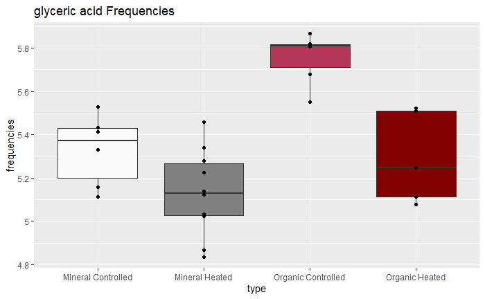

```{r setup, include=FALSE}
knitr::opts_chunk$set(echo = TRUE)
```

## What is a Boxplot?

A boxplot includes the 0th, 25th, 50th, 75th, and 100th percentil of a set of numbers. 

####  **Example**

If we had a dataset of 10 numbers: 
```{r}
dataset <- c(1,1,3,4,5,5,6,7,8,10)
```

basic R functions for boxplots:
```{r}
  quantile(dataset)
  boxplot(dataset)
```

A tutorial on introductory boxplots using R can be found here: https://www.statmethods.net/graphs/boxplot.html


## Looking at Metabolites: Boxplots

#### 1. We need to import the dataset of all metabolites and their frequencies in the soil samples (indicated as each variable/column)
```{r}
data <- read.csv("EMSL_PNNL.csv", header=TRUE)
```


#### 2. From a t-test of control vs heated groups of every metabolite, the mineral metabolites and organic metabolites that were significantly different between the two conditions were the following:


#### 3. Let's look at only one signficant metabolite: **glyceric acid**
```{r}
data_ga <- data[36,]
```

#### 4. Data Wrangling

  ggplot is an effective package in R that allows for plotting data in a clean and pretty manner. This includes boxplots, violin plots, line graphs, histograms, and more.

  ggplot plots two *variables* in a dataset as x and y of a grid. Thus, the x and y **must be columns** in a dataset. 

  In our current dataset "data_ga", we want to plot 4 boxplots with approximately 5-10 values in each boxplot. 
  

  So, the x column must include character values of "Mineral Control", "Mineral Heated", "Organic Control", and "Organic Heated". The y column must include the frquencies.

#####  We must **gather** the wide-looking dataset into the long-looking dataset. The function to do so is gather() (which is a function under the package tidyverse or subpackage tidyr) and more information can be found here:https://www.dropbox.com/sh/d5thhny56crrfir/AABLBA44Ngmlus--rLzlh7zGa/3.%20Data%20Wrangling?dl=0&preview=dataWrangling.pdf&subfolder_nav_tracking=1 
  
  
  
  _referenced from Dr. Douglas Rice of the Political Science Department; Winter 2020 Workshop_

```{r}
library(tidyverse)
data_ga_wrangled <- data_ga %>% gather("M_C_4_AB",	"M_C_7_AB",	"M_C_12_AB",	"M_C_14_AB",	"M_C_19_AB",	"M_C_30_AB",	"M_H_2_AB",	"M_H_2B",	"M_H_4_AB",	"M_H_11_AB",	"M_H_17_AB",	"M_H_26_AB",	"M_H_28_AB",	"M_H_30_AB",	"M_H_32_AB",	"M_H_34_AB",	"O_C_4_AB",	"O_C_12_AB",	"O_C_14_AB",	"O_C_19_AB",	"O_C_27_AB",	"O_C_34_AB",	"O_H_2_AB",	"O_H_4_AB",	"O_H_11_AB",	"O_H_17_AB",	"O_H_32_AB", key="type", value="frequencies")
```
######  The 'values' in the x column we called "type" are all different names even though all the ones starting with M_C are mineral controlled. Let's rename the values so that we only end up with 4 different values.
```{r}
data_ga_wrangled$type <- c("Mineral Controlled", "Mineral Controlled", "Mineral Controlled", "Mineral Controlled", "Mineral Controlled", "Mineral Controlled", "Mineral Heated", "Mineral Heated", "Mineral Heated", "Mineral Heated", "Mineral Heated", "Mineral Heated", "Mineral Heated", "Mineral Heated", "Mineral Heated", "Mineral Heated", "Organic Controlled", "Organic Controlled", "Organic Controlled", "Organic Controlled", "Organic Controlled", "Organic Controlled", "Organic Heated", "Organic Heated", "Organic Heated", "Organic Heated", "Organic Heated")
head(data_ga_wrangled)
```
#### 5. ggplot

the syntax of ggplot is first the data then its aesthetics (aes) which are essentially the variables of the graph. Then additional layers can be added "+".

Below, the fundamental ggplot is:
  ggplot(data, aes(x=type, y=frequencies, fill=type)))

  The 'fill' is the color of each boxplot. The color will be grouped up by the "type" of value (aka the x variable). 
  
Then, the added **layers** is "geom_boxplot()" _which makes the output a boxplot_ and "geom_point()" _which outputs points on the already added boxplots_. 

```{r}
ga <- ggplot(data_ga_wrangled, aes(type, frequencies, fill=type))
ga +
  geom_boxplot() + 
  geom_point()
```

#### 6. ggplot additional details

Next, let's add color to the boxplots and label (labs):

  To fill the boxplots with specific colors manually, hex codes can be used (and can be found online). Note that we've already filled the boxplots using the ggplot aesthetic "fill" by type (above) and we are now overlaying the default fills with manual colors.

```{r}
boxga <- ga + geom_boxplot() + geom_point() +
  scale_fill_manual(values=c("#808080", "#B43757", "#808080", "#830300")) +
  labs(title="glyceric acid Frequencies")
boxga
```

  Additional manipulations can be done to the ggplot including changing the axis labels, font sizes, colors, legend placement, etc. 
  
  Here is the ggplot cheatsheat:

  https://rstudio.com/wp-content/uploads/2015/03/ggplot2-cheatsheet.pdf
  

#### 7. Transformations

  A great explanation on why transformations are necessary in Biological statistics:

  http://www.biostathandbook.com/transformation.html

  Common transformations:
  
  * Log - allows incredibly large numbers to be transformed into digestable small numbers
  
  
  
  * Square-root - It is weaker than the log or cubed root and is used to reduce right skewedness
  
  
  
  * Square - To reduce right skewedness
  
  _referenced from:_ 
  
  _(https://fmwww.bc.edu/repec/bocode/t/transint.html) and Professor Roy Thompson FRSE of The University of Edinburgh._
  
  
####### Visual for Transformations

  

  from (https://www.statisticssolutions.com/transforming-data-for-normality/)  
  
###### Utilizing log transformations:
  
```{r}
boxga + scale_y_continuous(trans = 'log')
```
  The y-axis ticks are innacruate to the boxes. To change that, the breaks and labels must be corrected using trans_breaks and trans_format. These functions can be found in the package "scales".

```{r}
library(scales)
boxga + scale_y_log10(breaks = trans_breaks("log10", function(x) 10^x),
              labels = trans_format("log10", math_format(.x)))
```

  
  more information and a tutorial: https://r4ds.had.co.nz/transform.html
  
  
#### 8. Violin plots

  Similar to boxplots but includes a 'rotated kernel density' plot on each side rather than a box.
  
  

  Plotting the same data as a violin plot:
  
```{r}
violin_ga <- ga + geom_violin()
violin_ga
```
  You can display the *median and quartiles* in the form of a boxplot
```{r}
median_v_ga <- violin_ga + geom_boxplot(width=0.1, col="red")
median_v_ga
```
  Or the *mean and standard deviation*
```{r}
mean_v_ga <- violin_ga + stat_summary(fun.data=mean_sdl, geom="pointrange", color="red")
mean_v_ga
```
  With such small datasets, the standard deviation lines are unsurprising. Personally, of these two options (displaying mean or median), I prefer the violin plot with the median.
  
  More info is here: http://www.sthda.com/english/wiki/ggplot2-violin-plot-quick-start-guide-r-software-and-data-visualization
  
#### My work in Boxplots of Metabolites

  
  
  
  
  