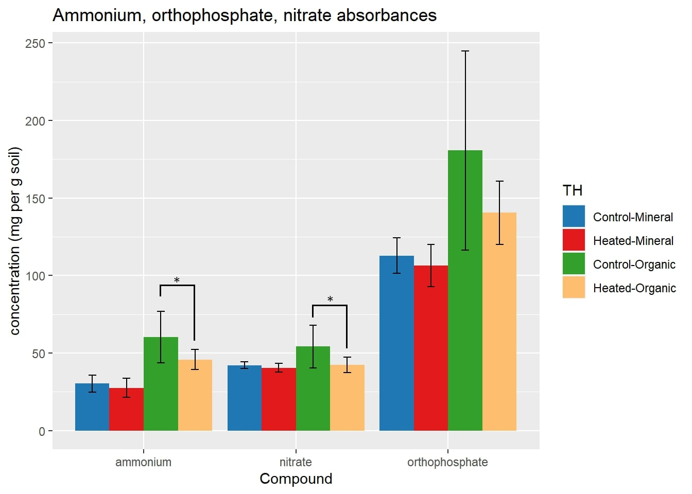

```{r setup, include=FALSE}
knitr::opts_chunk$set(echo = TRUE)
library(readxl)
library(ggplot2)
library(DT)
library(tidyverse)
library(rstatix)
```

```{r}
df <- read_excel("NitrogenPhosphorous/DATA.hf_nutrients.xlsx")
df$plot <- df$sample_id
dfclean <- df %>% separate(plot, c("rm.later", "plot"), sep="-", remove=FALSE, extra="merge") %>% select(-rm.later)
a <- dfclean %>% group_by(Horizon) %>% t_test(ammonium ~ Treatment) %>%
  add_significance()
op <- dfclean %>% group_by(Horizon) %>% t_test(orthophosphate ~ Treatment) %>%
  add_significance()
n <- dfclean %>% group_by(Horizon) %>% t_test(nitrate ~ Treatment) %>%
  add_significance()
dfstat <- rbind(a, op, n)
s.df <- df %>% group_by(treatment_hor) %>% summarize(mean.a = mean(ammonium), mean.o = mean(orthophosphate), mean.n = mean(nitrate))
### refer to rawdiff.xlsx to see differences of these raw means
diff <- read_excel("NitrogenPhosphorous/rawdiff.xlsx")
analysis <- merge(dfstat, diff)
datatable(analysis)
```

```{r}
df <- df[order(df$Horizon),]
df$treatment_hor <- factor(df$treatment_hor, levels = unique(df$treatment_hor))
levels(df$treatment_hor)
gg.df <- gather(df, condition, measure, ammonium:nitrate) %>% rename(TH = treatment_hor)
gg.df$TH <- recode(gg.df$TH, "c-m" = "Control-Mineral")
gg.df$TH <- recode(gg.df$TH, "h-m" = "Heated-Mineral")
gg.df$TH <- recode(gg.df$TH, "c-o" = "Control-Organic")
gg.df$TH <- recode(gg.df$TH, "h-o" = "Heated-Organic")
data_summary <- function(data, varname, groupnames){
  require(plyr)
  summary_func <- function(x, col){
    c(mean = mean(x[[col]], na.rm=TRUE),
      sd = sd(x[[col]], na.rm=TRUE))
  }
  data_sum<-ddply(data, groupnames, .fun=summary_func,
                  varname)
  data_sum <- rename(data_sum, c("mean" = varname))
 return(data_sum)
}
sd1 <- data_summary(gg.df, varname="measure", groupnames=c("TH", "condition"))
datatable(sd1)
ggplot(sd1, aes(x=condition, y=measure, fill=TH)) + geom_col(stat = "identity", position = "dodge")+ scale_fill_manual(values=c('#1F78B4','#E31A1C','#33A02C', "#FDBF6F")) + geom_errorbar(aes(ymin=measure-sd, ymax=measure+sd, width=.2), position=position_dodge(width=0.9)) + ggtitle("Ammonium, orthophosphate, nitrate absorbances") + xlab("Compound") + ylab("concentration (mg per g soil)")
```

### Edited Figure


