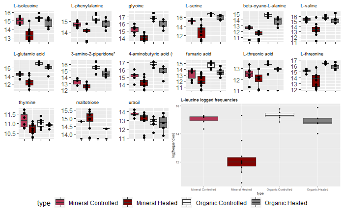
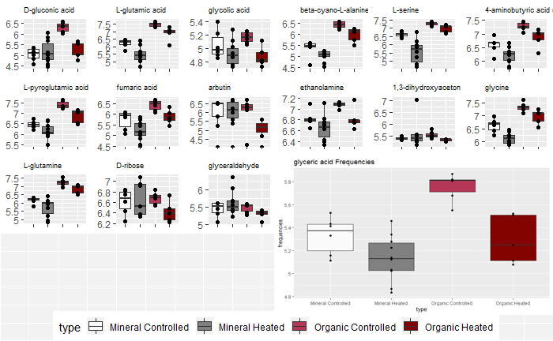

```{r setup, include=FALSE}
knitr::opts_chunk$set(echo = TRUE)
library(flexdashboard)
```

Metabolomics
=====================================  
   
Row {.tabset .tabset-fade}
-------------------------------------

### Mineral Metabolites



### Organic Metabolites



Row
-------------------------------------

[Written descriptions of the mineral metabolites](Metabolites_Boxplots/write-up.html)


Lipidomics
=====================================  

### *Lipidomics*

Calculating Summary of Lipid Counts, we found 31 significantly altered lipids where all but 1 diminished when treated with heat. TG's were unsurprisingly the largest lipid group to be found. The findings were inconclusive due to small sample sizes, and, unfortunately, nothing can be inferred from chain length or degree of saturation.


  [Initial Calculations](Lipidomics/compared_aligned.html)
  

  [Analysis with Figures](Lipidomics/Supplemental_Figures_Lipids.html)