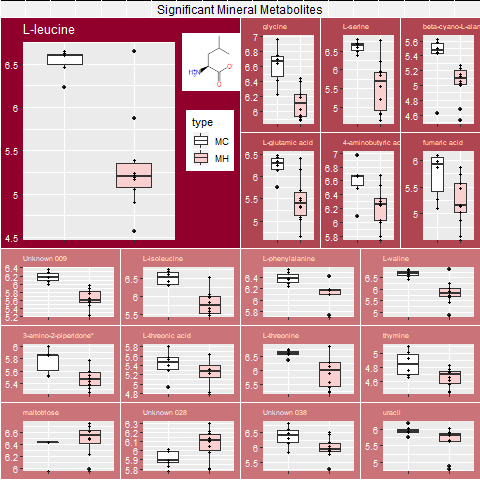

```{r setup, include=FALSE}
knitr::opts_chunk$set(echo = TRUE)
```

## Welcome to Proteomics!
   
  
#### Hanna Choi's Ongoing work:  

##### Boxplots of Metabolites

    
  * Mineral Metabolites
  
    

  * Organic Metabolites
  
    
 
  * [Written descriptions of the mineral metabolites](Metabolites_Boxplots/write-up.html)

##### Tutorial for Boxplots by Hanna Choi 04/06/2020

  [Boxplot Tutorial in R](Metabolites_Boxplots/boxplot_tutorial.html)
      
      
##### Lipidomics

   * CSV Datasets of significant lipids where p-value < 0.05:
  
  [Mineral](Lipidomics/Mineral_Lipids.csv)
  
  [Organic](Lipidomics/Organic_Lipids.csv)
  
   * Boxplots will be made of each Lipid Group. The unfinished code that I'm working on is below:
  
  [Boxplots unfinished; Heatmap deleted because it was incorrect](Lipidomics/compared_aligned.html)
  
  * p-value code is not finished and cannot work
  
  