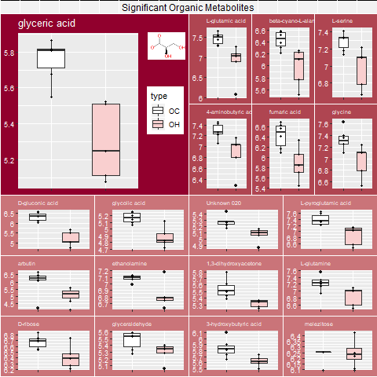

```{r setup, include=FALSE}
knitr::opts_chunk$set(echo = TRUE)
library(flexdashboard)
```

Metabolomics
=====================================  
   
Row {.tabset .tabset-fade}
-------------------------------------

### Mineral Metabolites


### Organic Metabolites



Row
-------------------------------------

[Written descriptions of the mineral metabolites](Metabolites_Boxplots/write-up.html)

[Boxplot Tutorial in R](Metabolites_Boxplots/boxplot_tutorial.html)
      

Lipidomics
=====================================  


CSV Datasets of significant lipids where p-value < 0.05 from attempt #1:
  
  [Mineral](Lipidomics/Mineral_Lipids.csv)
  
  [Organic](Lipidomics/Organic_Lipids.csv)
  

xlsx of dataset of p-values from attempt #2 and **current** code:
  
  [all p-values](Lipidomics/p-values_of_Lipids.csv)
  

Boxplots of each Lipid Group:
  
  [Mineral](Lipidomics/MineralLipids_Boxplots.pdf)
  
  [Organic](Lipidomics/OrganicLipids_Boxplots.pdf)
  

All the code for Lipidomics includes p-value calculations and boxplot creation:
  
  [HTML Code](Lipidomocs/compared_aligned.html)
  